# EShop(React/Redux(RTK)/Node/Typescript/Mailjet/Stripe)
This project contains a full service API, a client app and an admin app

## Features For react front-end
- Redux for state management
- Show products
- Pagination
- Allows admin to store products menu with image upload.
- Allows admin to edit products menu with image upload.
- Allows Admin to view and edit users, roles and sessions.
- Allows customers to order products while capturing their location(google maps geocoding), quantity, total price etc.
- Connects to API to send product order fulfilment or cancellation emails via mailjet to customers.
- Authentication for Admin(login and logout).
- Connects to API to allow Administrators to fulfil or cancel order with notes and emails via mailgun.
- Allows users to enter credit/debit card via stripe integration for product order payments.

## Features For API
- Endpoint to return products
- Endpoint store products with image upload.
- Endpoint to create, edit, soft delete users.
- Endpoint edit products
- Endpoint take location, quantity,total price as an order
- Endpoint that takes in order fulfilment or cancellation emails via mailjet to customers.
- API to Authenticate Admin login and logout
- Endpoint to allow Administrators to fulfil or cancel order with notes and emails via mailgun.
- Endpoint to take in credit/debit card payments via stripe integration.
- Pagination

## Installation for both frontend and backend

In the project directory, you can run:

### `npm install`
### `set up configs(API URL, stripe and googlemaps API) in src/Helpers/Url.js
### `npm run dev`

## React Admin frontend Packages
- React Router Dom
- React Redux with types
- Redux Tookkit with types
- Redux thunk with types
- Bootstrap
- Typescript

## Node API Packages used
- JWTs & refresh tokens
- Node.js
- TypeScript
- MongoDB with Mongoose
- Request validation via Zod
- Emails via Mailjet for order fulfilments and declines(cancellations)
- Stripe


## Seed Database
- Run postman collection to create users, products, orders and payments

## Troubleshooting
Find all postman endpoints in postman folder in root directory
If you happen to have issues after installing try to

- Install dependencies with npm
- Modify permissions for the servers upload  directory
```
```
<h2 id="screenshots">Admin Screenshots</h2>

<h6> Admin login page </h6>

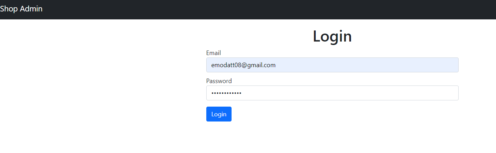

<h6> Admin sees all products </h6>

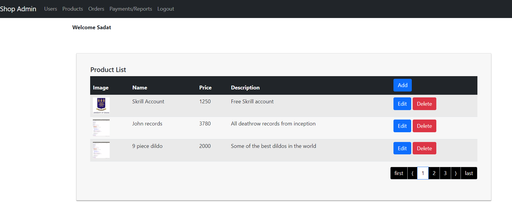

<h6> Admin can add products </h6>

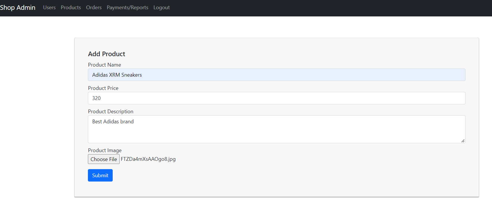

<h6> Admin can edit products </h6>

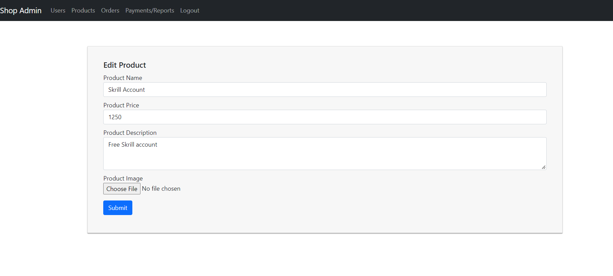

<h6> Admin sees orders </h6>

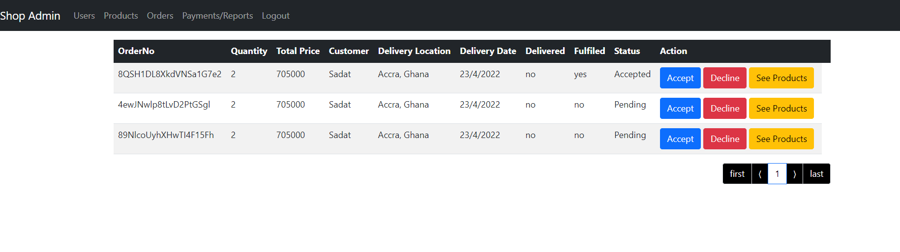

<h6> Admin sees products under an order </h6>

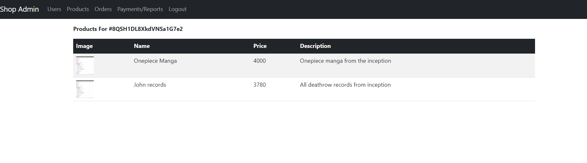


<h6> Admin fulfils order Fulfilment email sent </h6>

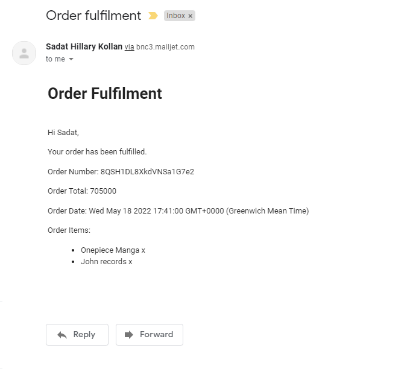

<h6> Admin declines order with reason and Declinement email sent with reason </h6>

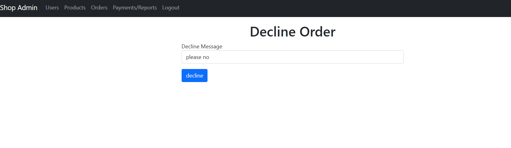

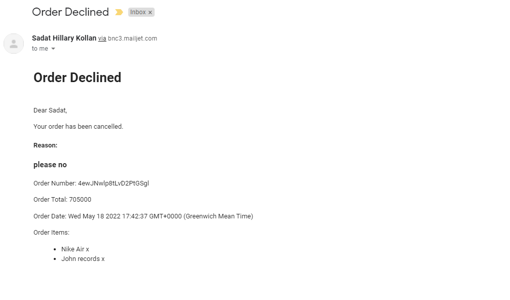

<h6> Admin sees users</h6>

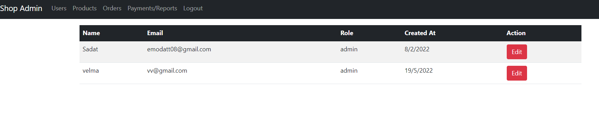

<h6> Admin edits users and sees sessions </h6>

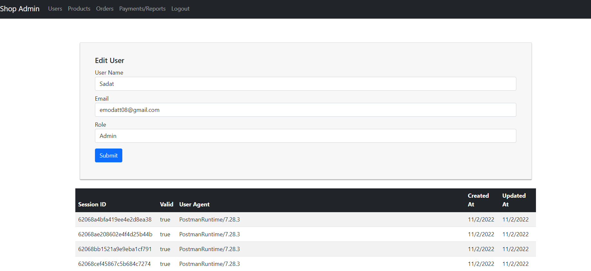

<h6> Admin sees payments </h6>

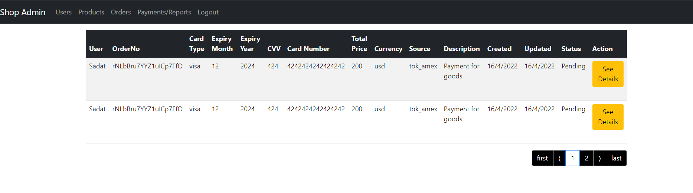

<h6> Admin sees payments details </h6>

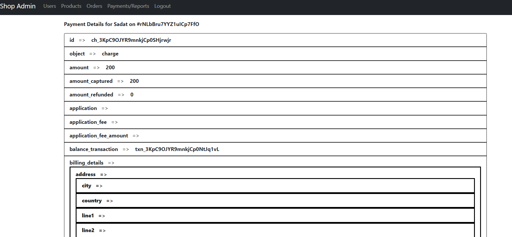
